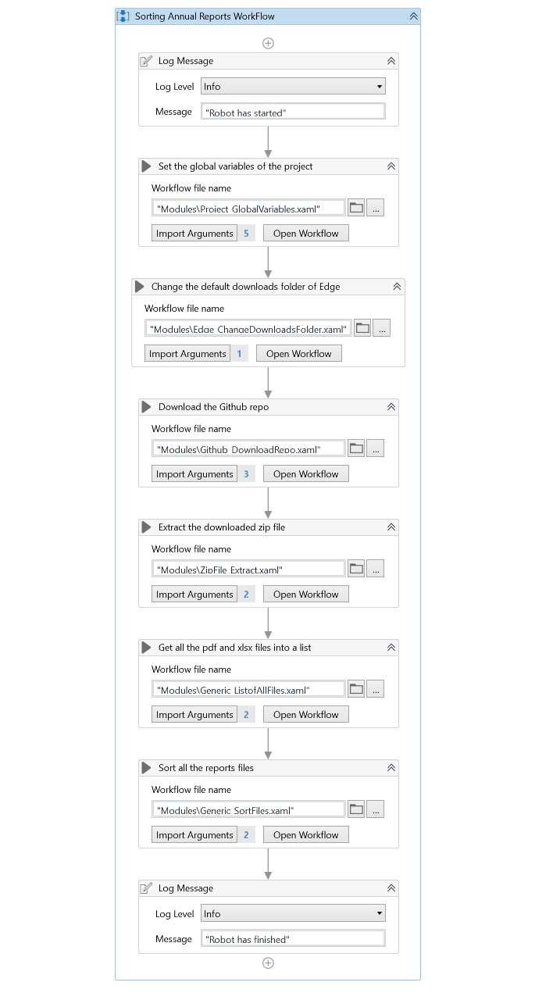
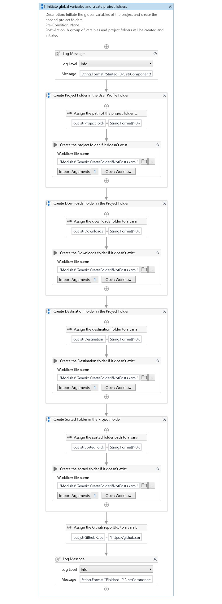
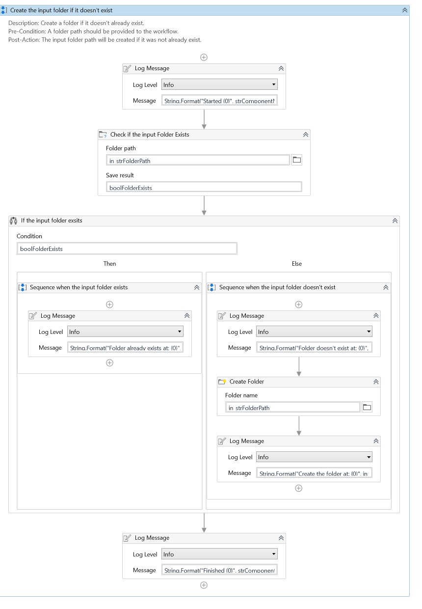
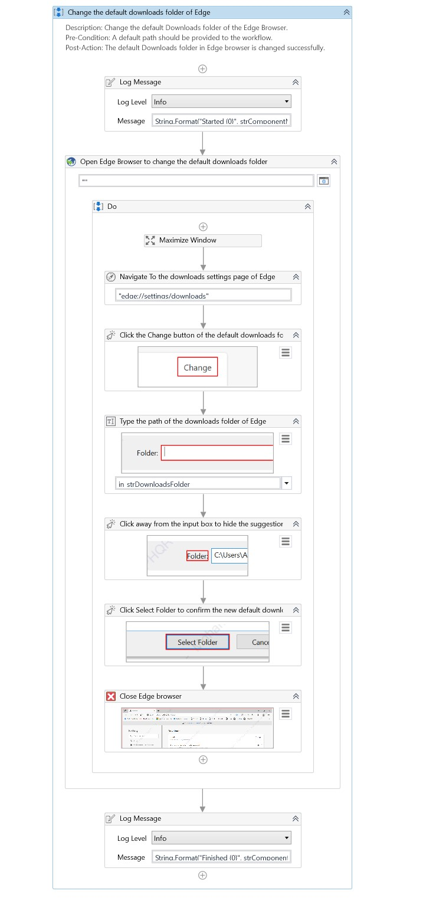
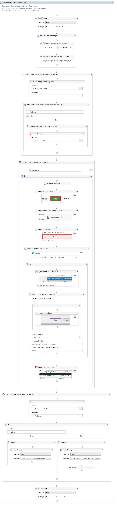
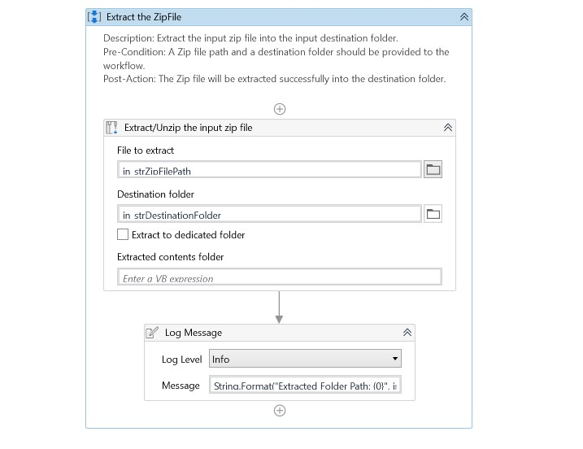
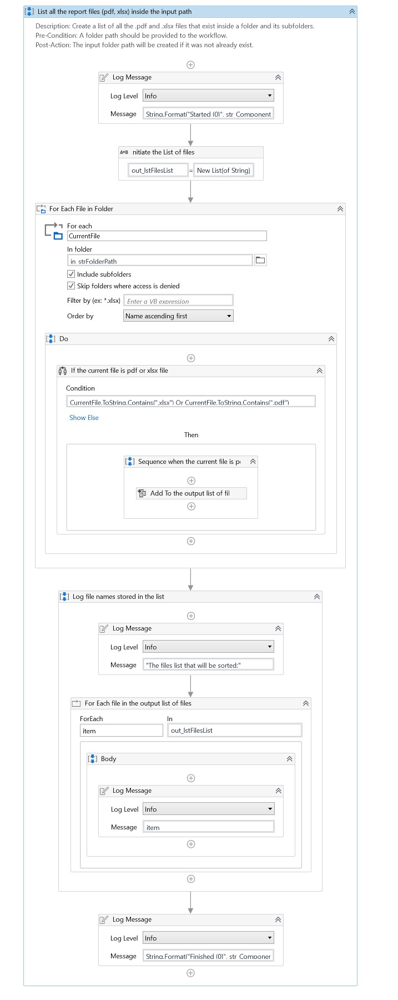
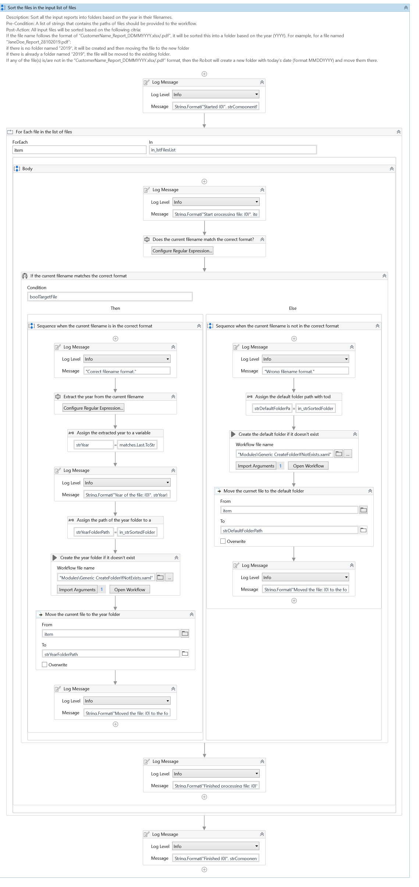

# Sorting Annual Reports

## Project Overview
In this Sorting Annual Reports project, I've developed an automation for a process that sorts files in a given folder into subfolders based on the date in the file name.

This project involves navigating to a webpage and downloading a zip file to sort. Then moving the file to a particular folder depending upon the process requirement:

1. For each file in the folder that follows this naming convention “CustomerName_Report_DDMMYYYY.xlsx/.pdf”, The bot creates a folder named “YYYY”(Date format) depending on the last four characters of the file name, which denotes the year in the “YYYY”(date format). For example, if the file name is “Heba_Report_13072019.pdf” then creates a folder with the name “2019” and moves the file into this folder.
2. If any of the files don't follow the naming convention, then the bot creates a new folder with today’s date (format MMDDYYYY) and moves them there.

## Workflows Screenshots

### Main Workflow

### Project_GlobalVariables Workflow

### Generic_CreateFolderIfNotExists Workflow

### Edge_ChangeDownloadsFolder Workflow

### Github_DownloadRepo Workflow

### ZipFile_Extract Workflow

### Generic_ListofAllFiles Workflow

### Generic_SortFiles Workflow

## About The Author

* Author: Mohamed Abdel-Gawad Ibrahim
* Contact: muhammadabdelgawwad@gmail.com
* Phone: +201069052620 || +201147821232
